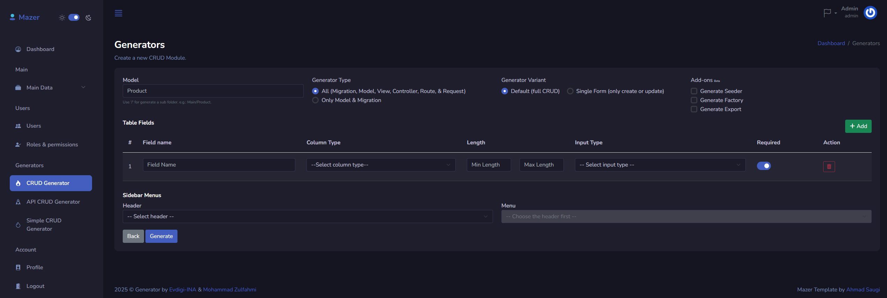
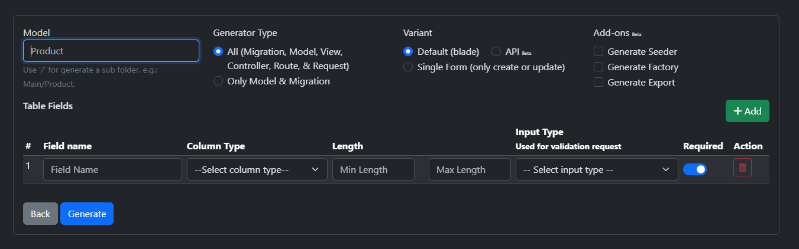

# Introduction

[Generator](https://github.com/Evdigi-INA/generator) is a Laravel-based open-source toolkit for building basic needs for administration interface setup like Create, Read, Update, and Delete. It's the minimalistic template or a starting point for developing CMS system, admin panel, or any other web application that requires CRUD functionality.

## The Reason

We have a bit of time to build <s>master</s> main data over and over again, therefore this package may let you focus on your core features application, Instead, you might use that time to sleep, play video games, or touch some grass.

## Who We Are

We're just bunch of people working on side project (freelance) developer based in Bekasi, Indonesia. We want to make a difference in the world by helping people making their own projects via open source and free software such like our creation.

## Pricing

Dont worry, it's 100% free & open source.

## License

MIT.